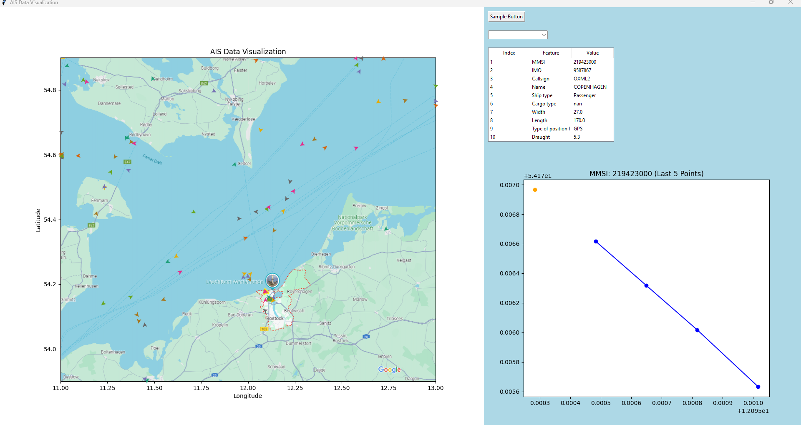

# Project Title

Dự án "Phân loại và phát hiện bất thường các mục tiêu trên biển sử dụng dữ liệu AIS"

## Table of Contents
    - [Project Title](#project-title)
- [Project Title](#project-title)
  - [Table of Contents](#table-of-contents)
  - [Giới thiệu](#giới-thiệu)
  - [Yêu cầu hệ thống](#yêu-cầu-hệ-thống)
  - [Cài đặt](#cài-đặt)
  - [Hướng dẫn sử dụng](#hướng-dẫn-sử-dụng)

## Giới thiệu
Dự án này nhằm mục đích Phân loại và phát hiện bất thường các mục tiêu trên biển sử dụng dữ liệu AIS. Cụ thể, nó sẽ giám sát hoạt động hàng hải trong một khu vực biển nhất định(dữ liệu được cung cấp trong Folder là dữ liệu của vùng biển quanh cảng Rostock Latitude từ 53.9-54.9 và Logitude 11-13 trong ngày 01-08-2024), bằng việc phân loại các đối tượng hoạt động trên vùng biển này(Fishing, Tanker/Cargo,Passenger) và áp dụng các thuật toán học máy, học sâu. Dự án khai còn khai thác các thông tin điều hướng của tàu(Latitude,Longitude,COG,SOG) để tiến hành phân tích, tìm ra các đặc điểm di chuyển từ đó xác định các hoạt động bất thường của tàu. 

## Yêu cầu hệ thống
- Python 3.10.14
- Các thư viện Python cần thiết (liệt kê trong `requirements.txt`).
  
  ## Cài đặt
1. **Clone repository:**
    ```bash
    git clone https://github.com/beotra/View_AIS.git
    cd View_AIS
    ```

2. **Tạo môi trường ảo:**
    ```bash
    conda create -n py310 python=3.10.14
    conda activate py310 
    ```

3. **Cài đặt các gói phụ thuộc:**
    ```bash
    pip install -r requirements.txt
    ```

## Hướng dẫn sử dụng
Chạy các lệnh chính trong dự án:
```bash
python plt_dynamic.py
 ```


 